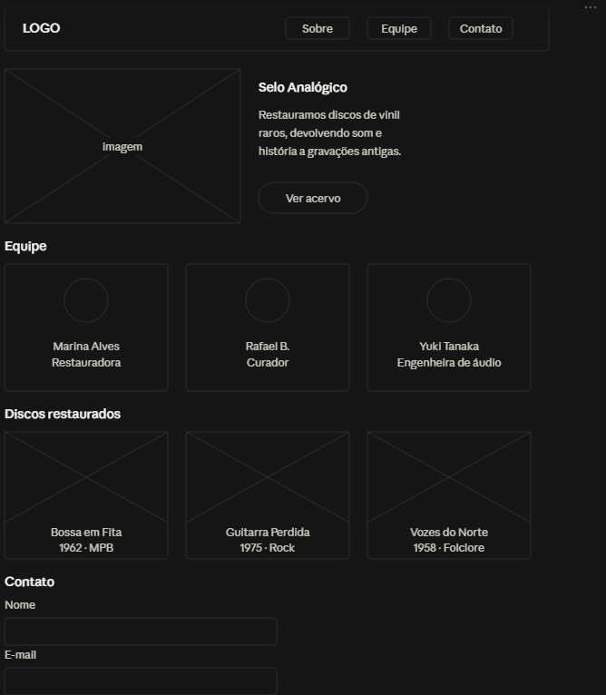
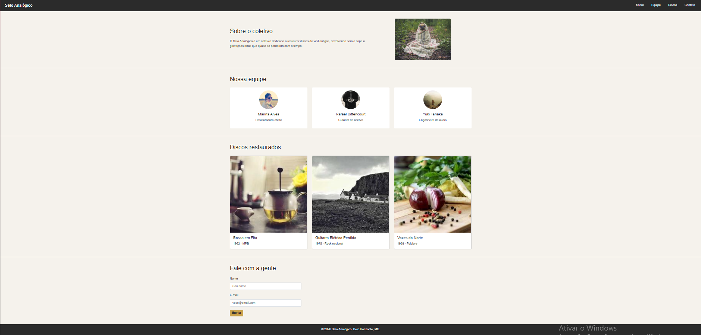
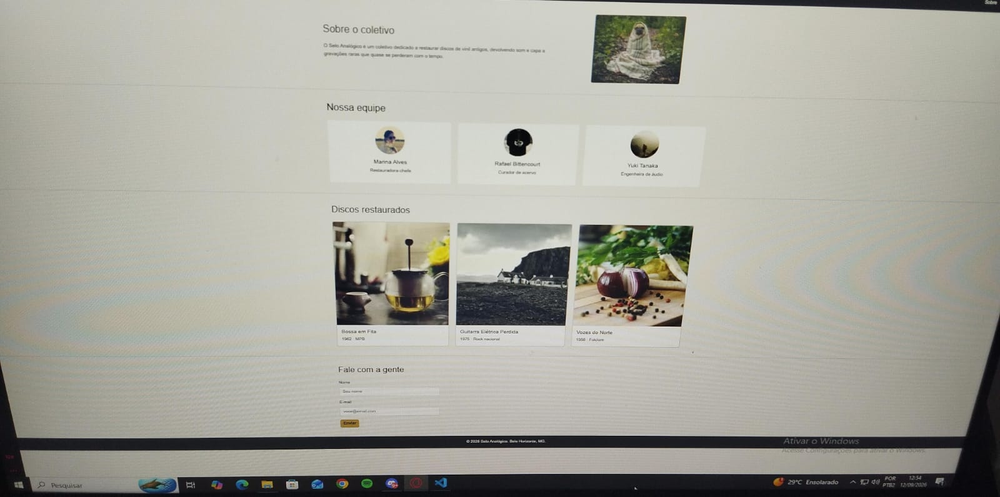

# Atividade-6-frontend
Selo Analógico
Dados básicos
Nome: Otávio Ribeiro Silva
Matrícula: 935831
Proposta escolhida: Proposta 3 — Organizações e Equipes
Tema: Coletivo de restauração de discos de vinil
Descrição do projeto

O Selo Analógico é um site fictício para um coletivo dedicado a restaurar discos de vinil raros e esquecidos. A entidade principal é a organização (o coletivo) e a entidade secundária são os membros da equipe e os discos restaurados (projetos do acervo). A home-page apresenta uma seção de apresentação do coletivo, a equipe responsável pelas restaurações, uma galeria com discos já restaurados e um formulário de contato.

Print da Wireframe:

Print pagina final:

Print por mobile:
 